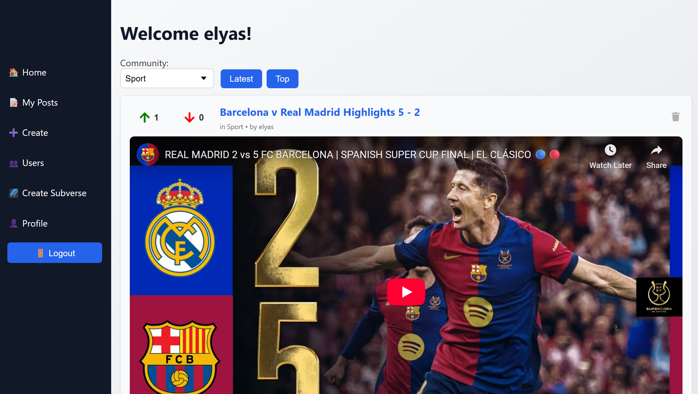
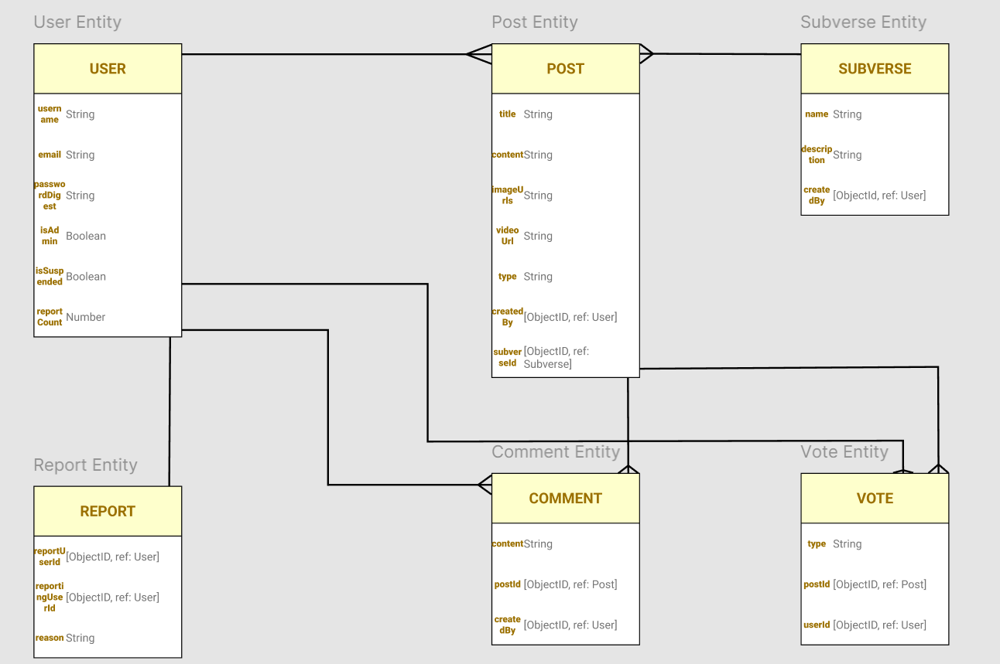
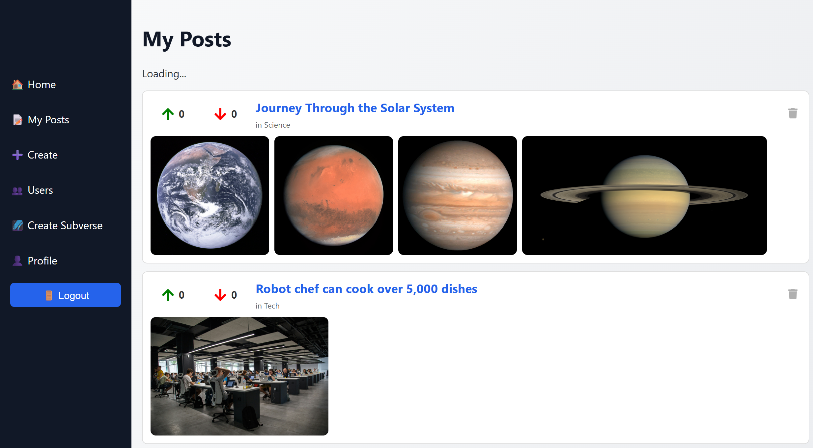
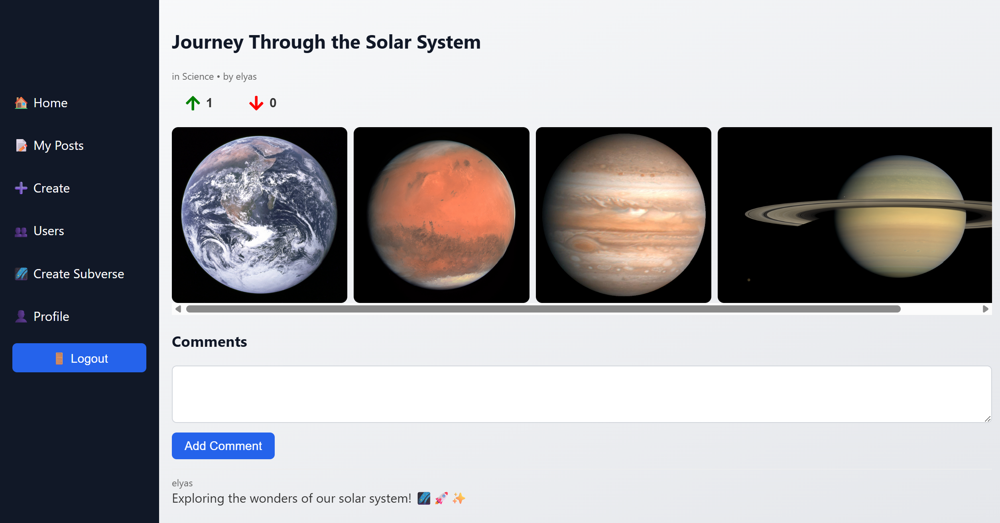
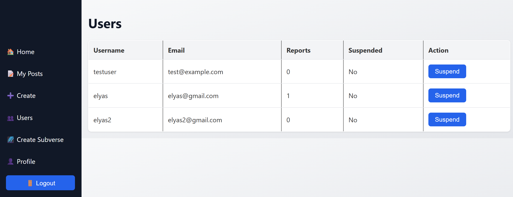

# SubVerse

## 📖 Description
**SubVerse** is a community-driven discussion platform inspired by Reddit.  
Users can create accounts, join communities ("Subverses"), and share posts containing text, images, or videos.  
Other users can upvote, downvote, and comment on posts.  
Admins have special permissions to manage users, handle reports, and create new Subverses.

### 💡 Background
This project was built to deepen my skills in the MERN stack (MongoDB, Express, React, Node.js) and to explore advanced features such as:
- User authentication (JWT-based)
- Role-based access control (admin vs. regular users)
- Real-time vote counts
- Reporting and moderation systems
- CRUD functionality for posts, comments, and communities

---

## 🚀 Getting Started

### **Live App**
[🔗 View the deployed app here](https://subverse.surge.sh)

### **Planning Materials**
- [ERD (Entity Relationship Diagram)](https://www.figma.com/design/AMxEAaQu1YFb0yMj5VgSap/SubVerse-ERD?node-id=0-1&t=QkUAyqmhdBFewtsf-1)  
- [Trello Board](https://trello.com/invite/b/689a1368ff2761eec6701321/ATTIa3a3b2f79b96e214de6d8eb3eb453e6c794277F0/subverse-planning-board)

### **Repositories**
- **Frontend Repo**: [GitHub Link to Frontend Repo](https://github.com/elyasalsaffar/SubVerse-FE)  
- **Backend Repo**: [GitHub Link to Backend Repo](https://github.com/elyasalsaffar/SubVerse-BE)

---

## 📚 Attributions
- [React Icons](https://react-icons.github.io/react-icons/) – for icons
- [Axios](https://axios-http.com/) – for HTTP requests
- [Express.js](https://expressjs.com/) – backend framework
- [Mongoose](https://mongoosejs.com/) – MongoDB ODM
- [React Router](https://reactrouter.com/) – for routing
- [MongoDB Atlas](https://www.mongodb.com/atlas) – database hosting

---

## 🛠 Technologies Used
- **Frontend**: React, React Router, Axios, CSS
- **Backend**: Node.js, Express.js, Mongoose
- **Database**: MongoDB Atlas
- **Authentication**: JSON Web Tokens (JWT), bcrypt
- **Other Tools**: Git, GitHub, Trello, ERD diagramming tools

---

## 📌 Next Steps
Planned future enhancements include:
- User-to-user private messaging
- Search functionality for posts and comments
- Community moderators (additional admin tier)
- Mobile-friendly responsive design improvements

---

## 📂 Project Structure
### **Frontend**
- `/components` – Reusable UI components (Sidebar, Layout, etc.)
- `/pages` – Page views (HomePage, PostDetails, ProfilePage, Admin Pages)
- `/services` – API request helpers

### **Backend**
- `/models` – Mongoose schemas (User, Post, Comment, Vote, Subverse, Report)
- `/controllers` – API request handlers
- `/routes` – Express routes
- `/middleware` – Authentication & role-checking middleware

---

## 🖼 ERD

---

## 📸 Screenshots
  
  
  
